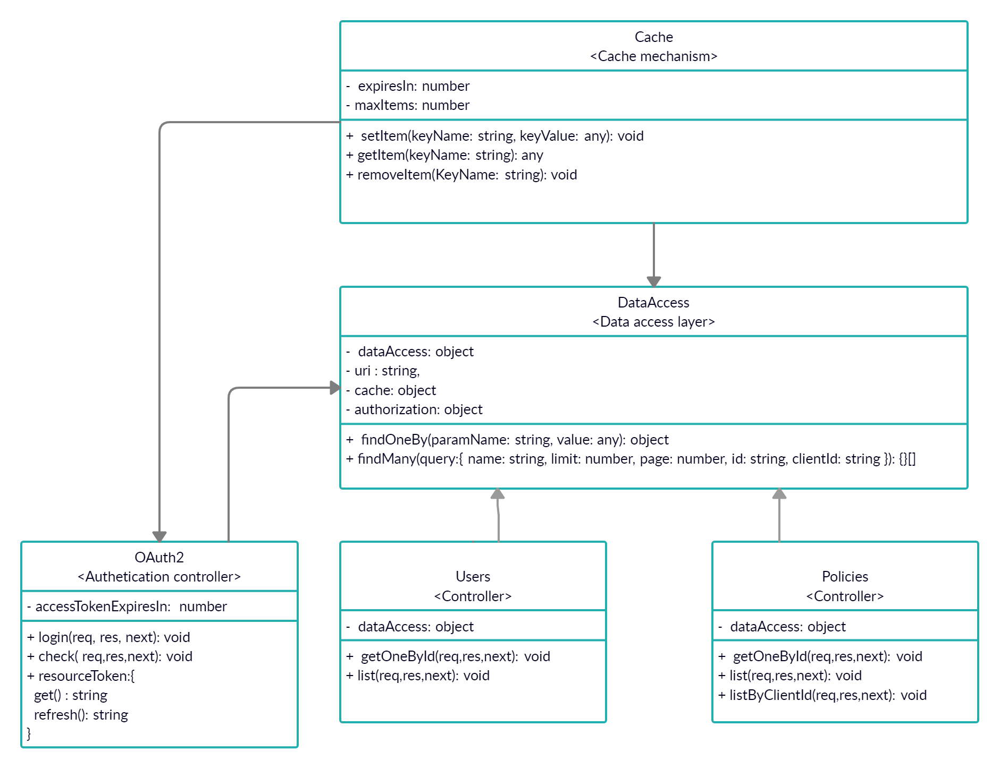

# Backend API REST for Insurance Company (Assessment)

## Statement

As an insurance company we've been asked to develop an application that manages some information about our insurance policies and company clients. To do that, we have two services that provide all the data we need:
- The list of company clients can be found at:
https://dare-nodejs-assessment.herokuapp.com/api/clients
- The list of company policies can be found at:
https://dare-nodejs-assessment.herokuapp.com/api/policies

With that information, we need to create a Web API that exposes the following services with some added constraints:

- Get user data filtered by user id -> Can be accessed by users with role "users" and "admin"
- Get user data filtered by user name -> Can be accessed by users with role "users" and "admin"
- Get the list of policies linked to a user name -> Can be accessed by users with role "admin"
- Get the user linked to a policy number -> Can be accessed by users with role "admin"We have the following constraints:
- REST API should be developed using some node framework (loopback or express)
- Think about licenses of 3d party libraries (if needed)
- Authentication and authorization. Take the user role from the web service that returns the list of company clients 

Our API REST middleware codebase delivered for the assessment must to follow the next mandatory points:

- Authentication and authorization. The authentication model must be based on https://tools.ietf.org/html/rfc6750.
- Include tests (at least 1 unit test, 1 integration test and one end to end tests).
- Using JavaScript ES6.
- Deliver the codebase on github or any source control tool. It would be great if we can see incremental steps at the commits history.
- Use Latest Node.js LTS version.
- DON'T USE A DB. The API REST youyr must to deliver is a middleware, so is very important to propagate the request to the data source INSURANCE API REST and to manage the error handling and the asynchronism.
Configuration of a linter and some specific rules to maintain code coherence style. For example https://github.com/airbnb/javascript/tree/master/packages/eslint-config-airbnb-base.


Recomendations:
- Solution properly structured.
- Usage of patterns: If you use some design pattern, explain the reasons.
- Add everything you think it is needed to ensure the product's quality & proper maintenance in case of an error.
- We expect to have a minimum documentation on a README file. We need to know what have you done and how to run your app. Also, if you have taken any decision or could not meet any of requirements, please explain it to us. Any documentation to help others to use the API REST is very valuable.
- In a possible interview, you can be asked for any part of your code, therefore, if you get some snippet or code from internet, be sure you understand how it works.
- Use the framework you feel more comfortable using (express.js, fastify...).

### Installation

Use the package manager [npm](https://www.npmjs.com/) to install Middleware REST API.

```bash
npm install
```

### Usage

To start the project in production mode:

```bash
npm start
```

To start the project in dev mode:

```bash
npm run dev
```

### User credentials

To log into the middleware api you can use a "name" of any user of the list and a general password "123".

    password: 123

### Documentation

Once the project is started, use  [this](http://localhost:3000/docs) link to see swagger documentation.

Endpoint: http://localhost:3000/docs

### Testing

To start all tests:

```bash
npm run test
```

To start unit testing:

```bash
npm run test:unit
```

To start integration testing:

```bash
npm run test:int
```

To start end to end testing:

```bash
npm run test:e2e
```

To debug tests:

```bash
npm run test:d
```

### Debug

To start debug mode:

```bash
npm run dev:d
```

### Class Diagram



## Solution Details 

- Dependency injection
  ...
- Factory function
  ...
- OAuth2 flow imitation

...

